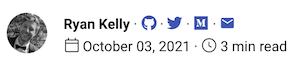

# How to blog with [Material MkDocs](https://squidfunk.github.io/mkdocs-material/)

## [Demo](https://material-mkdocs-blog.4kelly.com/) | [Instructions](https://material-mkdocs-blog.4kelly.com/setup/)

[MkDocs](https://www.mkdocs.org) is a static site generator. 
[Material MkDocs](https://squidfunk.github.io/mkdocs-material/) is a theme for MkDocs.
MkDocs has no built-in support for blogging, but it is extensible enough to easily add your own.
This repo is the experimental precursor to a MkDocs [plugin](https://www.mkdocs.org/dev-guide/plugins/), 
if there is demand.

🚀 Annotate your posts with a beautiful signature!

🚀 Turn any page into a list of blog posts. Checkout the [blog](https://material-mkdocs-blog.4kelly.com/blog/)! 

🚀 Standardize the look of each blog post with configurable metadata. Checkout a post [blog](https://material-mkdocs-blog.4kelly.com/blog/2021/cooking_post/)! 

--- 

For updates or feature requests, follow `@4kelly_` [Twitter](https://twitter.com/4kelly_).
