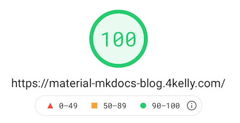

While I was evaluating static site generators, I came across a popular tool called [Eleventy](https://v0-11-0.11ty.dev).
It's a "simpler static site generator" written in javascript
that's intentionally not tied to any particular javascript framework or templating language.

At least partially through these attributes it's attracted a minimalist and performance oriented culture, 
epitomized by the official [Eleventy Performance Leaderboard](https://v0-11-0.11ty.dev/leaderboard/perf/) 
- a global ranking of [Lighthouse](https://web.dev/performance-scoring/) scores for websites created with Eleventy.
My favorite project built with Eleventy that I've found so far is 
[@cramforce's :material-twitter:](https://twitter.com/cramforce) [high-performance-blog](https://github.com/google/eleventy-high-performance-blog) template.

This got me thinking, how fast is [Material MkDocs?](https://squidfunk.github.io/mkdocs-material/)

#more

---

# Fast :rocket: :rocket: :rocket: 

{ align=left lazy=true }

- See the [results](https://developers.google.com/speed/pagespeed/insights/?url=https%3A%2F%2Fmaterial-mkdocs-blog.4kelly.com%2F&tab=desktop)
running a Lighthouse test against this blog.
- The `Diagnostics` section had some suggestions, which I'll tackle soon.
- Obviously this blog doesn't have much content or images, but this is a great starting point.

